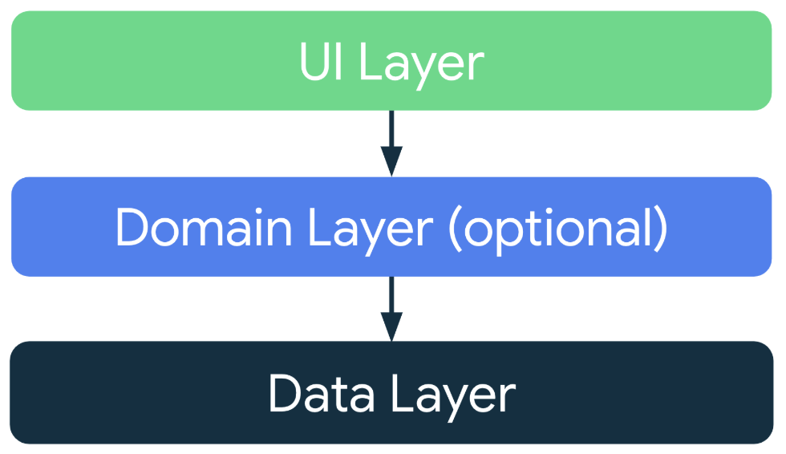
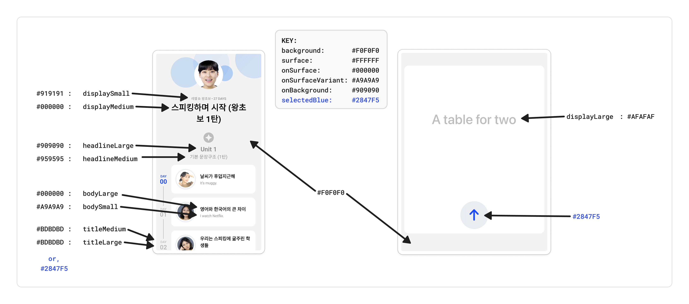

[](https://github.com/ivangarzab/talk/actions/workflows/build.yml)

# Speak Take-Home Project

[Skip to Setup Instructions](#how-to-set-up--run)

The purpose of this repository is to create a simple app that consists of two main screens: `CourseScreen` & `RecordScreen`.

The `CourseScreen` shows the `Course` data, which includes title and subtitle, thumbnail image of the user, as well as a list of units and their respective day lessons.  Additionally, the lessons are connected by a timeline stating which days they belong to.  

> I must've spend between 2-3 hours on the `CourseScreen`, including UI/UX & data setup.

The `RecordScreen`, on the other hand, consist of a simple enclosing box and a button.  Such box is meant to show the data that this screen is gathering from a web socket connection.

> I must've spend between 3-4 hours on the `RecordScreen`, including UI/UX, data setup, web socket setup and testing, plus the little extras I added into it for usability and presentation purposes.

Lastly, this web socket connection should be opened to do the following things:

- To send a 'start' message to the backend, meaning that we want to start streaming data
- To send `AudioChunk` data to the backend for processing, with the expectation that we'll receive text responses back

## Architecture

I decided to organize the application using a **DATA**/**DOMAIN**/**UI** architecture; as seen from the root project's `data`/`domain`/`features` + `app` directories.

This architecture ensures a good separation of concerns, and keeps the different layers of the app isolated from each other.

Similarly, this architecture I've built is meant to showcase the patterns of a Clean Architecture, at least up to a certain extent.

Moreover, this architecture is a direct interpretation of Android's own recommendations for *modern Android development*, as found in their [official documentation](https://developer.android.com/topic/architecture#recommended-app-arch).



Lastly, I'm using separate Gradle modules to further separate the different layers of the application; with some layers consisting of more than one Gradle module.

This approach is meant to optimize the build process, where each Gradle module may be build independently and increasingly.  Meaning that in non-first, subsequent builds, only the modules that have been changed will require an individual re-build.

There's also a `:resources` Gradle module that is holding all of the shared resources -- like drawables, colors and strings -- as wel as the Composable theme data so that every submodule has access to it. 

### UI Layer

The **UI Layer** is divided into two main components: the main `:app` Gradle module, and both of the feature Gradle modules inside the `features` dir: `:feature:course` & `:feature:record`.

The `:app` module is the "main" module of the app, containing the `LAUNCHER` `Activity`.

Both of the `feature` modules, on the other hand, contain Composable `Screen` implementations, plus their companion `ViewModel` classes.

### Domain Layer

For the **Domain Layer**, I decided to only create a single Gradle module, `:domain:record`, for its accompanying `:feature:record` feature module.

The reason why I decided to only create a *partial* **Domain Layer** was for demonstration purposes, and because the `course` feature or data was not hefty enough to require it for this sample application.

In a bigger or more fleshed out application, we would probably want a fuller **Domain Layer** containing interface classes for all the data repositories, as well as further use cases for the **UI Layer** to utilize. 

### Data Layer

For the `data` layer, I decided to use a monolithic Gradle module containing *all* of the application's data in order to keep it simple, and to not spend an immense amount of time setting up individual Gradle modules per data type.

In a bigger or more fleshed out application, we could further break down this monolith into individual Gradle modules in order to make a steeper separation of concerns, and to leverage Gradle's incremental build system even better.

## UI/UX

When it comes to the UI/UX, I attempted to recreate the screens that were given to me to the best of my ability, using simple screenshots only.  

The colors might not be 100% correct, nor the sizes or margins between elements, but I did the best I could without a design file.

Moreover, I took the time to implement an app-wide theme, consisting of a pre-defined Color palette that was included into the `MaterialTheme`, as well as Typography.

Here's a breakdown of how I analyzed, dissected and executed some of the theme-oriented decisions: 



All of the theme-related code is inside the `:resources` Gradle module; more specifically, see the `Theme.kt`.

Moreover, I made sure to implement Dark Mode, as well as a Splash Screen containing an Animated Vector Drawable (AVD) with a little animation -- the Splash Screen has a Dark Mode variant as well -- and I even included a Themed Icon implementation just for the fun of it.

## What I'm Most Proud About

There are a few things I'm proud about with respect to this little project.  

Some of these include things I hadn't done before, or I hadn't done to the extent I did it here.

Some others are simply a showcase of the extent of the tool belt of tricks and peculiarities I've developed in the last few years.

Here's a list of the things I would like to highlight:

1. Most of the `:data` module contains **unit tests**; the only classes that I did not create test classes for are the networking classes due to their complexity, and time time-constraints.
2. Dependency Injection using Koin: As a *Koin Community Lead*, it is (kind of) my duty to promote its use, and show how simple it is to get it started.
3. Dark mode: While new projects *almost* give you this for free nowadays, getting it to work properly does require some adjustments.
4. Comprehensive theme across the app: In a similar vein as Dark Mode, setting up colors, typography and such is half-baked into new projects, but requires some adjustments to get it to work properly.
5. Splash Screen: This is a personal favorite of mine, and I've written extensively about it in my Medium blog -- see my posts on [how to set up a splash screen](https://proandroiddev.com/inquiry-into-the-android-splashscreen-api-2023-e955946573b1), and [how to create an animated vector drawable](https://medium.com/geekculture/introduction-to-animated-vector-drawable-avd-for-android-8db301ad0776) to add extra flare.
6. Theme Icon: Another topic that I've written about before, this is another one of my preferred small details -- see my post on [how to set up theme icons](https://medium.com/proandroiddev/android-13-implementing-themed-icons-into-your-app-e7002f2c4e04).
7. Most importantly, developing a multi-module project with such a vast, and demarcated separation of concerns is something I've been wanting to do for some time.  This is probably what I enjoyed the most of this take-home project, and it's allowed me to showcase my understanding of Gradle (perhaps) to its full extent.

## Trade-Offs

I took the reservation executing a few trade-offs for this particular sample application.

Some of them have been listed already in this document, but here's a comprehensive list of most -- if not all -- of the trade-offs that I took:

1. The **Domain Layer** is thin, and mainly encompasses the `record` screen feature in order to showcase the full architecture, without getting too deep into the weeds of Clean Architecture with multi-modules.
2. The **Data Layer** is monolithic in order to keep it simple, rather than it being fully broken down for even further separation of concerns.
3. There's a little bit of *bloat* overall in the project that was added through the project and module creation processes.  Some of these files could be removed or cleaned up further for a more production-ready app.
4. While I attempted to create unit test classes for the entire `:data` Gradle module, I had to skip the network classes due to their complexity; these are the kind of classes you can spend a good chunk of time making sure the tests are written correctly!
5. In the same vein, most of the test cases I added **were generated by AI**.  While I have plenty of experience creating test cases, I think the ideal shouldn't be to spend *hours* creating test cases by hand, but rather, creating testable code, and allowing modern tools to help out in this regard.
6. When it comes to git, I decided to commit directly into the `main` branch, rather than create a parallel `develop` branch for development.  In a production app, however, I would leave `main` only for release pushes, and develop on top of a `develop` branch; more akin to [Gitflow Workflow](https://www.atlassian.com/git/tutorials/comparing-workflows/gitflow-workflow).
7. Similarly, while I chose to leverage small PRs in order to fully demonstrate how I work, I merged this directly in order to keep the Git history, in case y'all were interested in looking at that.  In a production app, I prefer to **Squash & Merge**, and flatten the history a bit for easier navigation after the fact. 

## What's Next

If I was to take this project and attempt to make it into a real and complete production app, these are the things I would do next:

1. Set up ProGuard correctly: While ProGuard is almost always a pain, I've got plenty of experience dealing with it for both client and SDK products.
2. Bring in a crash reporting tool, such as Crashlytics: This is of outmost importance for any production app, and should be high on any list for apps that don't have it already.
3. Setting up CI/CD: While I did add a small, GitHub Action file to simply build the project on pushes to the `main` branch, a fuller, more exhaustive pipeline should be build to streamline testing, building different environments or flavours, and releases as well. 
4. Update all dependencies: I'm a little bit obsessed with keeping my dependencies as up-to-date as possible. 
   - This ensures that I stay on the vanguard of the different technologies we're using, and avoid falling behind and risk something loosing support without me knowing so.
5. Lastly, I would create a Play Console app, and start getting everything ready for an imminent release.  
   - Given my [Google Play Console Listing Certificate](https://playacademy.withgoogle.com/certificate/), am I vastly familiar with this process, and have gone through it more than once. 
   

------------------

# How To Set Up & Run

## Prerequisites

Download:
- Android Studio (the latest version is recommended)
- Java JDK 11 or higher

Plug-in a physical Android device, or boot up an Emulator that supports at least Android 9 (SDK 28)

## Step 1: Clone the Repository

```bash
git clone https://github.com/ivangarzab/talk.git
cd talk
```

## Step 2: Set up Gradle properties

Add the following field to your global `gradle.properties` file (located at `~/.gradle/gradle.properties`):
```kotlin
WS_ACCESS_TOKEN=<your web socket access token surrounded by double-quotation marks '"'>
```

> **NOTE:** If the file is not at that location, you should create it!

## Step 3: Open the project in Android Studio

1. Launch Android Studio 
2. Select Open an Existing Project 
3. Navigate to the cloned repository and select it

## Step 4: Sync and Build

1. Sync Gradle manually, or wait for it to finish after a cold boot of the project
2. Select `Build > Make Project`
3. With a physical or virtual device connected, Select `Run > Run 'app'`

#### *If you have any problems, holla at me [@ivangarzab](http://github.com/ivangarzab)!*
